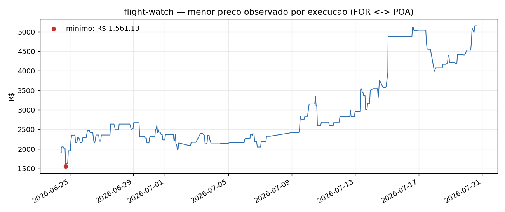

# flight-watch

Airfare price monitor. It collects the lowest price on a route every hour, stores the series in CSV and sends a Telegram message when the price crosses into another configured band.

## Usage

    pip install -r requirements.txt && playwright install chromium
    cp config.example.json config.json
    python watch.py      # one collection
    python analyze.py    # summary and chart of the series

Each run is independent and the state lives in `state.json`. Schedule it with cron, a systemd timer or the Windows Task Scheduler.

## How it works

Playwright loads the results page and reads `span.price-pointer`, the total price with fees. Values below `noise_floor` are discarded.

The lowest price is mapped to one of the `tiers`. A notification fires when the band differs from the one recorded on the previous run, in both directions: the band re-arms when the price goes up, so a later drop notifies again.

## Results

636 runs between 24 June and 6 August 2026. While the search still returned results, 497 of 506 runs collected a price. Five notifications sent.

## Notes

- The selector is `span.price-pointer` because `span.value` holds the base fare without fees and would understate the price by hundreds of reais.
- There's no stop condition: the monitor keeps running after the travel date, which produces the empty readings at the end of the series.
- One route per instance; several routes mean several copies, each with its own `config.json`.
- To run as SYSTEM on Windows, `FLIGHT_WATCH_SITE_PACKAGES` points to the user's site-packages and Chromium lives in `browsers/` inside the project.

## Stack

Python 3.14, Playwright, requests, pandas, matplotlib.
